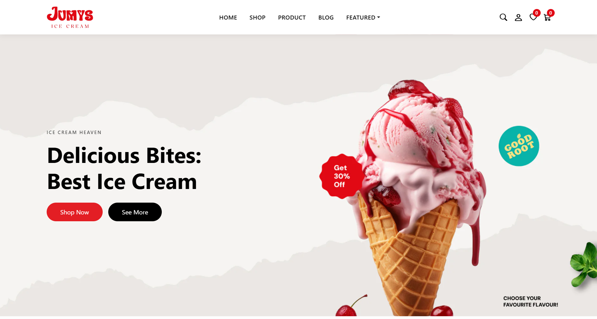
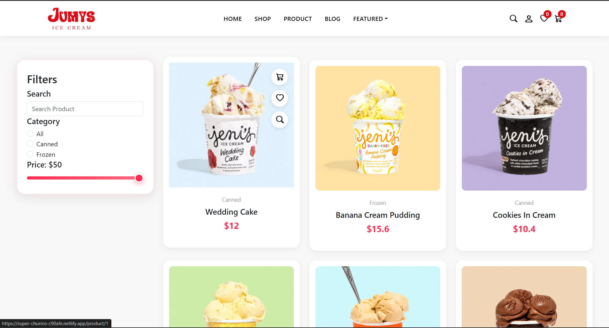
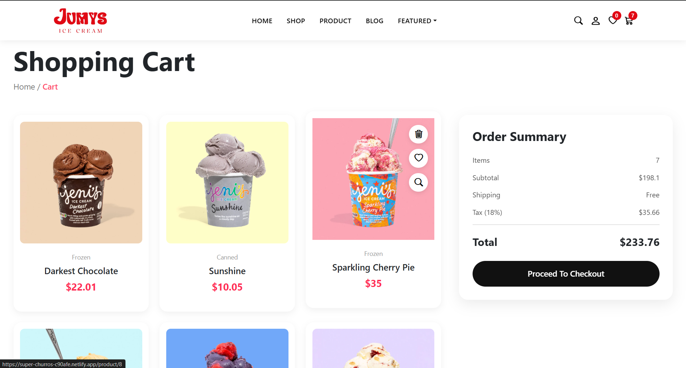
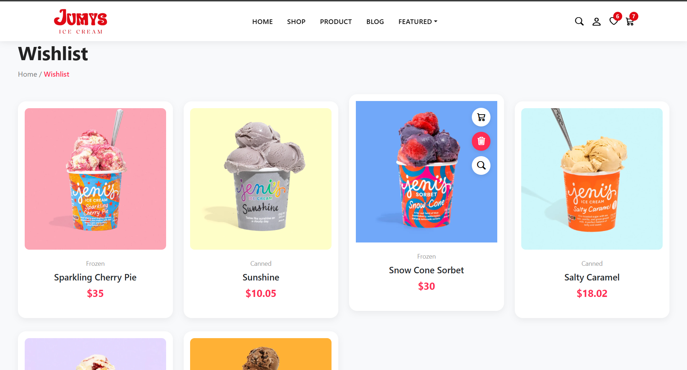

<div align="center">

# 🍦 Jumys Ice Cream - E-Commerce Website

### A modern, fully responsive Ice Cream E-Commerce experience built with React.js

[](https://react.dev/)
[](https://developer.mozilla.org/en-US/docs/Web/JavaScript)
[](https://getbootstrap.com/)
[](https://developer.mozilla.org/en-US/docs/Web/CSS)
[](https://developer.mozilla.org/en-US/docs/Web/HTML)
[](#-responsive-design)
[](https://github.com/your-username/jumys-ice-cream)

</div>

---

<div align="center">

## 🚀 Live Project

<a href="https://your-live-demo-link.com" target="_blank">
  
</a>

<a href="https://github.com/your-username/jumys-ice-cream" target="_blank">
  
</a>

</div>

---

## 🍨 About the Project

**Jumys Ice Cream** is a modern, fully responsive **Ice Cream E-Commerce website** built entirely with **React.js**. It delivers a complete online shopping experience — from browsing a beautifully designed landing page to searching, filtering, and previewing products, managing a cart and wishlist, and exploring a built-in blog. The project leverages **Local Storage** to persist cart and wishlist data across sessions, offering a smooth, app-like user experience without requiring a backend.

This project was built to demonstrate strong front-end engineering skills — clean component architecture, responsive UI design, state management, and attention to real-world e-commerce UX patterns.

---

## ✨ Features

- 📱 **Responsive Design** — Seamless experience across desktop, tablet, and mobile
- 🎨 **Beautiful Landing Page** — Engaging hero section and modern visual design
- 🛍️ **Product Listing** — Browse the full ice cream catalog with ease
- 🔍 **Product Details Page** — Dedicated page with full product information
- 🔎 **Product Search** — Instantly find products by name
- 🧰 **Product Filter** — Filter products by category/type
- 🛒 **Shopping Cart** — Add, view, and manage items in the cart
- ➕➖ **Cart Quantity Management** — Increase/decrease item quantities on the fly
- ❤️ **Wishlist** — Save favorite products for later
- 👁️ **Quick View Modal** — Preview product details without leaving the page
- 📝 **Blog Listing** — Browse ice cream-related blog articles
- 📖 **Blog Details Page** — Read full blog content
- ℹ️ **About Page** — Learn more about the brand/story
- ❓ **FAQ Page** — Answers to common customer questions
- 📩 **Contact Page** — Get in touch form/section
- 👤 **Account Page** — User account section
- 🚫 **404 Error Page** — Custom error page for unmatched routes
- 💾 **Local Storage Integration** — Persistent cart & wishlist data
- ⚡ **Smooth User Experience** — Fast, fluid interactions throughout

---

## 📸 Screenshots

> Replace these placeholders with actual screenshots of your project.

**🏠 Home Page**


**🛍️ Shop Page**


**📦 Product Details**


**🛒 Cart Page**


**❤️ Wishlist Page**


---

## 🛠 Tech Stack

| Technology | Purpose |
|---|---|
| ⚛️ **React.js** | Core front-end library for building UI components |
| 🧭 **React Router DOM** | Client-side routing and navigation |
| 🟨 **JavaScript (ES6+)** | Application logic and interactivity |
| 🅱️ **Bootstrap** | Responsive layout and pre-built UI components |
| 🎨 **CSS3** | Custom styling and animations |
| 🌐 **HTML5** | Semantic page structure |
| 💾 **Local Storage API** | Persisting cart and wishlist data |

---

## 📂 Folder Structure

```
jumys-ice-cream/
├── public/
├── src/
│   ├── assets/
│   ├── Components/
│   │   ├── About/
│   │   ├── Blog/
│   │   ├── Common/
│   │   ├── Home/
│   │   ├── Products/
│   │   └── Shop/
│   ├── Pages/
│   ├── App.jsx
│   ├── main.jsx
│   └── index.css
├── package.json
└── README.md
```

---

## ⚙ Installation

Follow these steps to run the project locally:

```bash
# 1. Clone the repository
git clone https://github.com/your-username/jumys-ice-cream.git

# 2. Navigate into the project directory
cd jumys-ice-cream

# 3. Install dependencies
npm install

# 4. Start the development server
npm run dev
```

The app will now be running locally — open the URL shown in your terminal (typically `http://localhost:5173`) to view it in the browser.

---

## 🚀 Future Improvements

Planned enhancements to take this project to the next level:

1. 🔗 **Backend Integration** — Connect to a REST/GraphQL API for dynamic data
2. 🔐 **Authentication** — Secure user login and registration system
3. 💳 **Payment Gateway** — Integrate Stripe/Razorpay for real checkout
4. 📦 **Order Tracking** — Real-time order status and history
5. 🛠️ **Admin Dashboard** — Manage products, orders, and users
6. ⭐ **Product Reviews** — Allow customers to rate and review products
7. 🎟️ **Coupons & Discounts** — Promo code support at checkout
8. 🌙 **Dark Mode** — Toggle between light and dark themes
9. 🔥 **Firebase Authentication** — Social login and secure auth flows
10. 🗄️ **Database Integration** — Store products, users, and orders persistently

---

## 📱 Responsive Design

This project is fully responsive and optimized for all screen sizes:

- 🖥️ **Desktop** — Full-featured, multi-column layouts
- 📱 **Tablet** — Adaptive grid and touch-friendly components
- 📲 **Mobile** — Compact, mobile-first navigation and layouts

---

## 📚 What I Learned

Building this project helped me strengthen the following skills:

- 🧩 Structuring a scalable React project with reusable components
- 🧭 Implementing multi-page navigation using React Router DOM
- 💾 Managing persistent state using the Local Storage API
- 🛒 Building real-world e-commerce logic (cart, wishlist, quantity management)
- 🎨 Designing responsive layouts using Bootstrap and custom CSS
- 🔍 Implementing search and filter functionality for dynamic product lists
- 🪟 Creating interactive UI elements like Quick View modals
- ⚙️ Managing component state and props effectively across nested components
- 🚫 Handling edge cases like 404 routes and empty states
- 🚀 Improving overall UX through smooth transitions and clean UI design

---

## 💻 Author

**Manisha Nahak**
Full Stack Developer

[](https://linkedin.com/in/your-linkedin-handle)
[](https://github.com/your-github-handle)
[](https://your-portfolio-link.com)

---

## ⭐ Support

If you like this project, please consider giving it a **⭐ star** on GitHub — it motivates me to keep building and improving!

---

## 📄 License

This project is licensed under the **MIT License**.
Feel free to use, modify, and distribute it for personal or commercial projects.

---

<div align="center">

Made with ❤️ and 🍦 by **Manisha Nahak**

</div>
